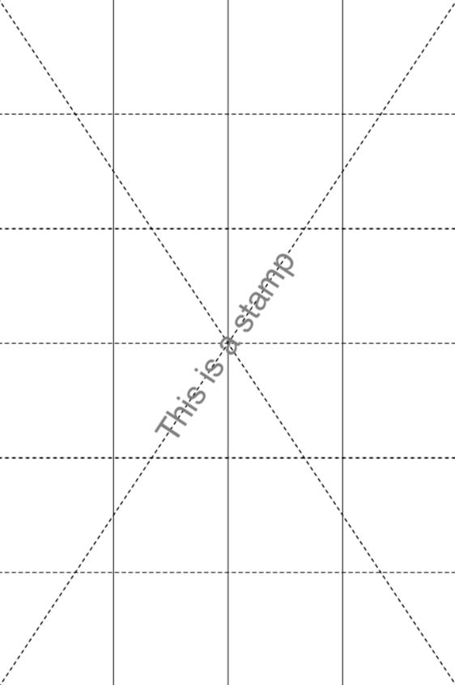
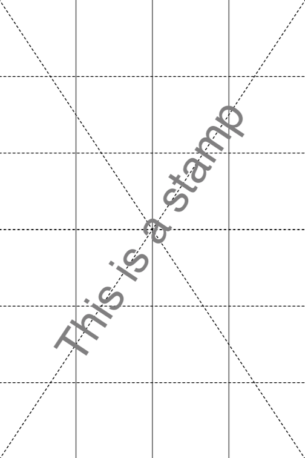
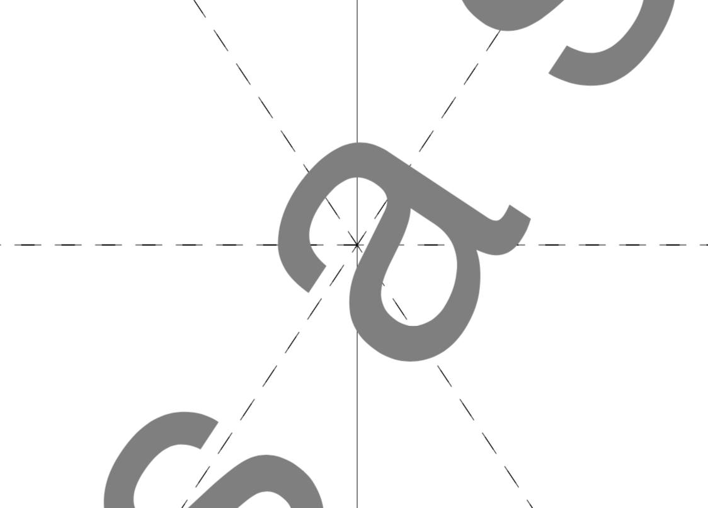

# Stamp

Add a stamp to selected pages of `inFile`.

The stamp is centered on the page and using `description` you can configure various aspects like rotation, scaling and opacity. For text based stamps you can also configure font name, font size, fill color and render mode.

## Usage

```
pdfcpu stamp [-v(erbose)|vv] [-pages pageSelection] [-upw userpw] [-opw ownerpw] description inFile [outFile]
```

You can stamp or watermark `inFile` exactly once. It is highly recommended to make a backup of `inFile` before running this command or even better use `outFile`.
<br>

---
NOTE

In the Adobe world a watermark is text or an image that appears either in front of or behind existing document content, like a stamp comment aka stamp annotation that anybody reading the PDF can open, edit, move around and delete. The difference here is that a watermark is integrated into a PDF page as a fixed element. Within `pdfcpu` the meaning of these terms is slightly different:

* `stamp` is any *content* that appears in front of the existing page content - sitting on top of everything else on a page

* `watermark` is any *content* that appears behind the existing page content - residing in the page background

where *content* may be text, an image or a PDF page.

---
<br>

### Flags

| flag                             | description          | required
|:---------------------------------|:---------------------|:--------
| [verbose](../getting_started.md) | turn on logging      | no
| [vv](../getting_started.md)      | verbose logging      | no
| [pages](../getting_started/page_selection) | page selection  | no
| [upw](../getting_started.md)     | user password        | no
| [opw](../getting_started.md)     | owner password       | no

<br>

### Arguments

| name         | description          | required | default
|:-------------|:---------------------|:---------|:-
| description  | configuration string | yes
| inFile       | PDF input file       | yes
| outFile      | PDF output file      | no       | inFile_new.pdf

<br>

### Description

A configuration string to specify the stamp parameters.

The first entry of the description configures the type. It is one of the following:

* text string
* image file name
* PDF file name followed by an optional page number

| parameter | description                     | values                                              | default
|:----------|:--------------------------------|:----------------------------------------------------|:-
| f         | fontname, a basefont            | Helvetica, Times-Roman, Courier                     | Helvetica
| p         | fontsize in points              | in combination with absolute scaling only           | 24
| s         | scale factor                    | 0.0 < i <= 1.0 followed by optional `abs` or `rel`  | 0.5 rel
| c         | color, 3 fill color intensities | 0.0 <= r,g,b <= 1.0, eg. 1.0, 0.0 0.0 = red         | 0.5 0.5 0.5 = gray
| r         | rotation angle                  | -180.0 <= i <= 180.0                                | 0.0
| d         | render along diagonal           | 1 .. lower left to upper right                      | 1
|           |                                 | 2 .. upper left to lower right                      |
| o         | opacity                         | 0.0 <= i <= 1.0                                     | 1
| m         | render mode                     | 0 .. fill                                           | 0
|           |                                 | 1 .. stroke                                         |
|           |                                 | 2 .. fill & stroke                                  |

Only one of rotation and diagonal is allowed.

The following description parameters are for text based stamps only:

* font name
* font size
* color
* render mode

<br>

#### Default description

```sh
'f:Helvetica, p:24, s:0.5 rel, c:0.5 0.5 0.5, r:0, d:1, o:1, m:0'
```

The default stamp configuration is:

* fixed center page position (free positioning will be part of a future release)
* scale factor `0.5 rel`ative to page dimensions
* positive rotation along the diagonale from the lower left to the upper right page corner (`d:1`).
* fully opaque stamp by defining `o`pacity `1`

In addition for text based stamps:

* font name `Helvetica`
* font size `24` points
* fill color grey (`0.5 0.5 0.5`)
* render mode fill (`m:0`)

You only have to specify parameters that differ from the default.
<br>

## Examples

### Text Based Stamps

Create a stamp using defaults only:
```sh
pdfcpu stamp 'This is a stamp' test.pdf out.pdf
```
<p align="center">
  
</p>

<br>
Create a stamp using scale factor 1:

```sh
pdfcpu stamp 'This is a stamp, s:1' test.pdf out.pdf
```

<p align="center">
   &nbsp; &nbsp; &nbsp; &nbsp;
  
</p>

Create a text based stamp:

<br>

Create an image based stamp:

<br>

Create a PDF based stamp:


<p align="center">
  
</p>


<p align="center">
  
</p>

<p align="center">
  
</p>

<p align="center">
  
</p>

e.g. 'Draft'                                                  'logo.png'
     'Draft, d:2'                                             'logo.tif, o:0.5, s:0.5 abs, r:0'
     'Intentionally left blank, s:.75 abs, p:48'              'some.pdf, r:45'
     'Confidental, f:Courier, s:0.75, c: 0.5 0.0 0.0, r:20'   'some.pdf:3, r:-90, s:0.75'